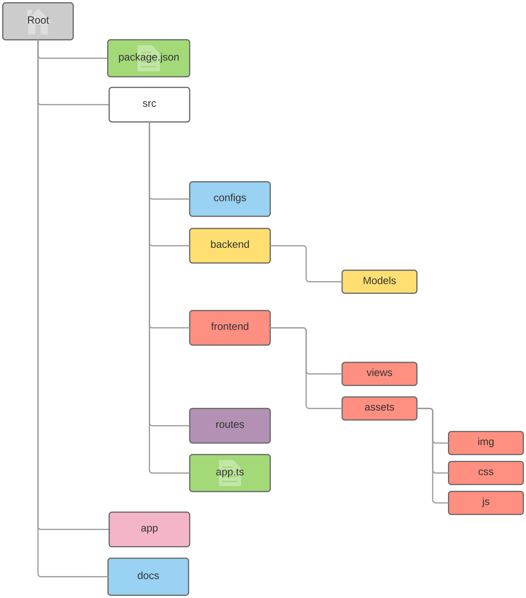

# Reader Critics

&nbsp;

&nbsp;

### Table of Contents

* [Project Setup](doc/project-setup.md) - Instructions how to get from the checkout to a running system
* [Glossary](doc/glossary.md) - Set some vocabulary straight first
* [Data Scheme](doc/data-scheme.md) - Entities and relations used for persisting to the database
* [Crazy Ideas](doc/think-about-these-crazy-ideas.md) - We won't do that right now, but we really want to

### Project Structure

<small>Map diagram ℗ + © Traktorsimen Berge</small>
