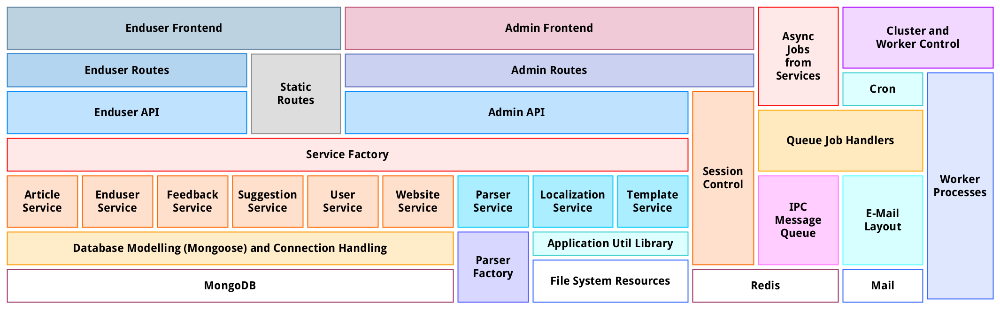

# Application Architecture

This is a rough model of the parts and pieces of the application and how they are aligned to each other, in the classic sense of layers. Of course not every little piece is included in this graphic and there are also parts who have a more horizontal relationship.

But it should give a good impression about the main building stones of _Reader Critics_.

Diagram created with [yEd](https://www.yworks.com/products/yed)
&nbsp;&bull;&nbsp;
[Source GraphML file here](img/application-architecture.graphml)
